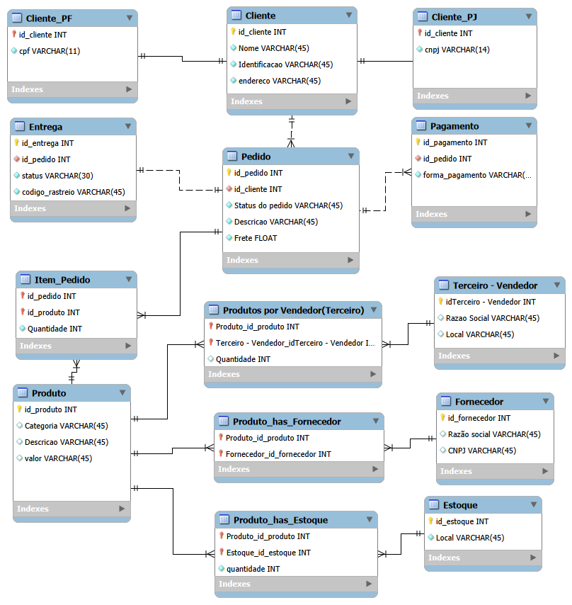

# Projeto E-commerce — Modelagem de Banco de Dados

## Descrição do Projeto

Este projeto foi desenvolvido como parte da Formação SQL Database Specialist da DIO.

O objetivo é realizar a modelagem de um banco de dados para um cenário de e-commerce, utilizando o modelo Entidade-Relacionamento Estendido (EER), e posteriormente implementar o esquema em banco de dados.

O projeto parte do modelo apresentado pela expert e realiza os refinamentos solicitados no desafio.

---

## Objetivo do Desafio

Refinar o modelo apresentado acrescentando os seguintes requisitos:

- Cliente PJ e PF — uma conta pode ser PJ ou PF, mas não pode possuir as duas informações;
- Pagamento — um pedido pode possuir mais de uma forma de pagamento;
- Entrega — possui status e código de rastreio.

---

## Modelo Conceitual

O modelo contempla as principais entidades relacionadas ao funcionamento do e-commerce:

- Cliente
- Cliente PF
- Cliente PJ
- Pedido
- Produto
- Fornecedor
- Estoque
- Pagamento
- Entrega
- Item do Pedido
- Produto_has_Fornecedor
- Produto_has_Estoque

---

## Principais Relacionamentos

### Cliente e Pedido

Um cliente pode realizar vários pedidos.

**Cliente 1:N Pedido**

### Cliente PF e Cliente PJ

O cliente pode ser especializado em Pessoa Física ou Pessoa Jurídica.

**Cliente 1:1 Cliente_PF**

**Cliente 1:1 Cliente_PJ**

A regra do desafio determina que uma conta deve ser PF ou PJ, não podendo possuir as duas informações.

### Pedido e Pagamento

Um pedido pode possuir mais de uma forma de pagamento.

**Pedido 1:N Pagamento**

### Pedido e Entrega

A entidade Entrega foi acrescentada ao modelo para armazenar:

- Status da entrega
- Código de rastreio

A cardinalidade entre Pedido e Entrega será definida conforme a regra de negócio adotada no projeto.

### Pedido e Produto

Um pedido pode possuir vários produtos e um produto pode participar de vários pedidos.

Essa relação N:N é implementada através da entidade associativa `Item_Pedido`.

### Produto e Fornecedor

Um produto pode ser disponibilizado por diferentes fornecedores e um fornecedor pode disponibilizar diferentes produtos.

Essa relação N:N é implementada através da entidade associativa `Produto_has_Fornecedor`.

### Produto e Estoque

Um produto pode estar associado a diferentes estoques e um estoque pode possuir diferentes produtos.

Essa relação N:N é implementada através da entidade associativa `Produto_has_Estoque`, que também armazena a quantidade disponível.

---

## Modelo EER



---

## Tecnologias e Ferramentas

- MySQL
- MySQL Workbench
- Modelo EER
- SQL
- Git
- GitHub

---

## Estrutura do Projeto

```text
ecommerce-database-model/
│
├── README.md
└── modelo_eer_ecommerce.png


### ⚠️ Um detalhe importante

Eu **não coloquei uma cardinalidade 1:1 definitiva em `Pedido → Entrega`**, porque, como verificamos no material que você enviou, o requisito informa os atributos da entrega, mas **não especifica essa cardinalidade**.

Isso é melhor do que colocar no README uma afirmação que o material não sustenta.

---

### Agora faça somente isto

Cole o conteúdo acima no `README.md` e pressione:

**Ctrl + S**

Depois me diga **"salvei"**.

Aí vamos fazer a próxima etapa: verificar o README no VS Code antes de enviá-lo ao GitHub.